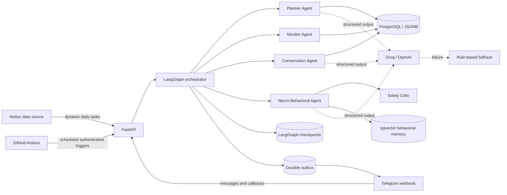

# Neuro-Cognitive Alignment Engine

[](https://github.com/gullcan/neuro-cognitive-alignment-engine/actions/workflows/ci.yml)
[](https://www.python.org/)
[](https://github.com/langchain-ai/langgraph)
[](https://fastapi.tiangolo.com/)
[](https://github.com/pgvector/pgvector)

A production-deployed, stateful multi-agent system that turns a dynamic Notion schedule
into an approved daily plan, monitors execution through Telegram, and generates bounded,
context-aware coaching with an LLM.

This is not a generic reminder bot. The engineering problem is intent–action alignment:
preserve a user's plan as durable state, observe only reported actions, retrieve relevant
behavioral context, and provide a useful next step without inventing psychological or
neurological facts.

- **Live API health:** [neuro-cognitive-alignment-engine.onrender.com/health/live](https://neuro-cognitive-alignment-engine.onrender.com/health/live)
- **Architecture deep dive:** [docs/architecture.md](docs/architecture.md)
- **Render + Neon deployment:** [docs/deployment/render.md](docs/deployment/render.md)

## What it does

1. Reads the day's tasks from a structured Notion data source.
2. Builds an ordered plan and sends it to Telegram for human approval.
3. Re-syncs Notion every 15 minutes without resetting an unchanged approved plan.
4. Opens tasks at their scheduled time and follows up on missing starts, progress, and
   obstacles.
5. Accepts both inline buttons and free-form Turkish messages.
6. Records explicit self-reports such as started, completed, blocked, skipped, or
   rescheduled.
7. Retrieves task history and similar behavioral episodes before producing feedback.
8. Uses a deterministic Safety Critic and a local fallback around probabilistic LLM output.

Example interaction:

```text
User: Bugün çalışmak istemiyorum.

Agent: Şu an istememen, sıradaki iş için karar veremeyeceğin anlamına gelmiyor.
       Yalnızca ilk adımı beş dakika uygula; sürenin sonunda devam edip etmeyeceğine
       yeniden sen karar ver.

User: Bu görevi bitirdim.

Agent: Bu işi kapattın; bugün kendine verdiğin sözü davranışa çevirdin.
       Başlamanı kolaylaştıran şeyi bir cümleyle not et, sonra sıradaki işe geç.
```

Reluctance is not silently recorded as failure. A task status changes only when the user
reports an explicit action with sufficient confidence and the selected task belongs to
today's approved plan.

## System architecture



The graph owns control flow; the LLM does not own scheduling, authorization, database
writes, callback routing, or delivery retries.

## Agent responsibilities

| Agent | Input | Responsibility | Output |
|---|---|---|---|
| Planner Agent | Today's Notion tasks | Orders tasks and creates a bounded daily plan | `DailyPlan` |
| Monitor Agent | Approved plan, time, recorded actions | Emits due/start/progress/evening controls | Outbox messages |
| Conversation Agent | Free text, focused task, plan activity, evidence | Interprets explicit self-reports and writes a natural reply | `ConversationDecision` |
| Neuro-Behavioral Agent | Task action, counts, similar episodes | Produces evidence-grounded behavioral feedback | `NeuroFeedback` |
| Safety Critic | Structured feedback and evidence | Rejects unsupported biological, clinical, shaming, or dependency claims | approve / retry / fail closed |

These are specialized graph nodes with explicit contracts—not five autonomous bots
chatting without control. That distinction keeps the system testable and auditable.

## LangGraph state and routes

Every inbound event is normalized into a shared typed state. The claim node first enforces
idempotency, then routes the event:

```text
claim inbound event
├── daily plan
│   └── Notion -> Planner -> content-aware persistence -> approval message
├── task monitor
│   └── approved plan + task activity -> scheduled controls
├── plan decision
│   └── approve/reject -> persist decision -> task controls
├── task behavior
│   └── event + memory -> evidence retrieval -> feedback -> Safety Critic
└── free-form Telegram message
    └── plan + focus + evidence -> Conversation Agent -> optional task action
```

Graph checkpoints persist execution state and recovery history. Operational event tables
remain the source of truth for user actions. Behavioral vector memory is a separate
retrieval concern.

## Reliability and safety decisions

- **Idempotent ingress:** Telegram update IDs and scheduler request IDs are claimed once.
- **Content-addressed plans:** unchanged polling preserves approval and sends no duplicate.
- **Human-in-the-loop:** a new or edited plan remains pending until Telegram approval.
- **Durable outbox:** messages are persisted, leased, retried, and dead-lettered before
  transport concerns can affect graph control flow.
- **At-least-once delivery:** retry leases and dead-letter state handle transient failures.
- **Typed LLM output:** Pydantic schemas constrain plans, feedback, and conversation intent.
- **LLM fallback:** Groq/OpenAI failures fall back to deterministic local behavior.
- **Bounded memory:** 32-dimensional observable planning-context vectors; no claim of
  measuring mental states.
- **Safety boundary:** no diagnosis, dopamine measurement, guaranteed transformation,
  shame, coercion, or assistant-dependency language.
- **Secret boundaries:** Telegram webhook secret, internal scheduler key, database URL, and
  LLM keys remain environment variables.

## Technology stack

| Layer | Technology | Purpose |
|---|---|---|
| Language/runtime | Python 3.12, uv | Typed async application and reproducible dependency lock |
| API | FastAPI, Uvicorn, Pydantic | Webhooks, internal scheduler endpoints, validation |
| Orchestration | LangGraph | Stateful routing, retries, checkpoints, specialized agents |
| Integrations | Notion API, Telegram Bot API, HTTPX | Dynamic tasks and user interaction |
| LLM | Groq or OpenAI Responses API | Structured planning and personalized guidance |
| Persistence | PostgreSQL, SQLAlchemy async, JSONB | Plans, events, inbox, outbox |
| Retrieval memory | pgvector, HNSW cosine index | Similar behavioral context lookup |
| Schema management | Alembic | Versioned, reviewable database migrations |
| Delivery reliability | Durable leased outbox | Retryable Telegram delivery |
| Deployment | Docker, Render, Neon | Zero-cost public API and durable managed PostgreSQL |
| Scheduling/CI | GitHub Actions | Daily planning, 15-minute monitoring, quality gates |
| Quality | Ruff, strict mypy, pytest | Formatting, linting, type safety, behavioral tests |
| Observability | structlog, health/readiness probes | Structured events and platform diagnostics |

## Data model

The application owns five operational tables:

- `inbound_events`: inbox/claim ledger for idempotent external events.
- `domain_events`: append-only observed plan and task actions.
- `daily_plans`: one content-versioned plan per user/date with approval status.
- `outbox`: leased Telegram messages with retry and dead-letter state.
- `behavioral_memories`: task episodes, observable context, and pgvector embedding.

LangGraph checkpoint tables are created by LangGraph and intentionally remain outside the
Alembic-owned operational schema.

## Notion contract

The configured data source must expose these properties:

| Property | Type | Required |
|---|---|---|
| Task | Title | yes |
| Window | Date with start time | yes |
| Status | Status | yes |
| Commitment Tier | Select | yes |
| Priority | Select | yes |
| Definition of Done | Rich text | yes |
| Minimum Action | Rich text | yes |
| Estimated Minutes | Number | optional |
| Cognitive Load | Number (1–5) | optional |
| Context Cue | Select or rich text | optional |
| Evidence Required | Checkbox | optional |
| Evidence | URL | optional |

Only tasks matching the requested date and not marked `Archived` are imported.

## Run locally

Requirements: Docker and uv.

```bash
cp .env.example .env
docker compose up -d postgres
uv sync --extra dev
uv run alembic upgrade head
uv run neuro-alignment
```

Then open:

- OpenAPI: `http://localhost:8000/docs`
- Liveness: `http://localhost:8000/health/live`
- Readiness: `http://localhost:8000/health/ready`

Do not commit `.env`. Add Notion, Telegram, and Groq/OpenAI credentials only through local
environment variables or the deployment platform's secret UI.

## Quality gates

```bash
uv lock --check
uv run ruff format --check src tests migrations
uv run ruff check src tests migrations
uv run mypy src
uv run pytest
uv run alembic check
```

The CI workflow runs the lock, format, lint, type, and test checks on every push and pull
request to `main`.

## Deployment

The portfolio deployment uses:

- Render Free Docker web service for HTTPS webhooks and API execution.
- Neon Free PostgreSQL with pgvector for durable data and checkpoints.
- GitHub Actions for the 07:35 daily plan and 15-minute Notion sync/monitor cycle.

The container runs Alembic before replacing itself with Uvicorn. Render and Neon free tiers
can cold-start, so reminder delivery is approximate rather than SLA-backed. Persistent
idempotency prevents retries from creating duplicate logical controls.

See the complete procedure in [docs/deployment/render.md](docs/deployment/render.md).

## Honest limitations

- Single-user authorization model; this is not yet a multi-tenant SaaS.
- Telegram and Notion self-reports are observations; the system cannot verify physical work.
- Free hosting and LLM tiers have cold starts, quotas, and no production SLA.
- Vector retrieval uses engineered planning-context features rather than a learned semantic
  embedding model.
- Telegram delivery is at-least-once at the provider boundary.
- No clinical or neuroscientific outcome is measured.

These are explicit architectural boundaries, not hidden assumptions.

## Documentation

- [Architecture and engineering decisions](docs/architecture.md)
- [Render + Neon deployment](docs/deployment/render.md)
- [Database migration operations](migrations/README)
