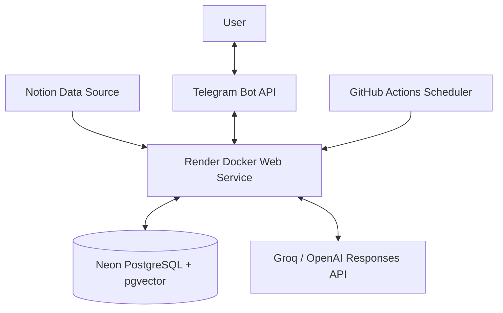
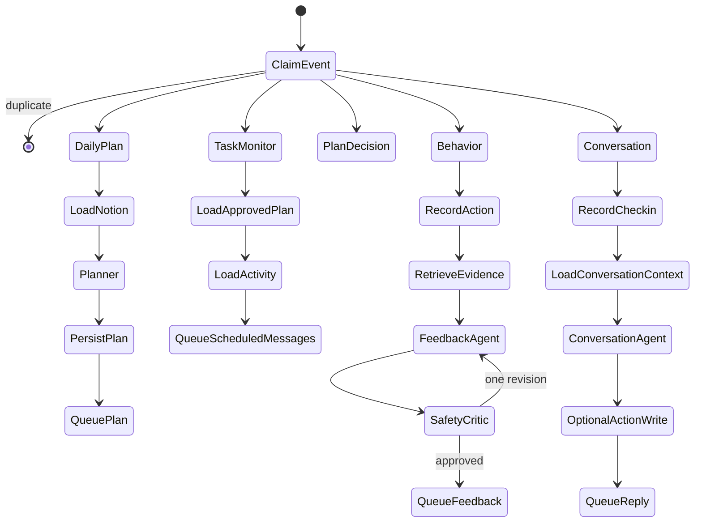

# Architecture and Engineering Decisions

## 1. Scope

Neuro-Cognitive Alignment Engine is a single-user, event-driven application. Notion is the
planning source, Telegram is the interaction channel, LangGraph is the orchestration layer,
PostgreSQL is the operational source of truth, and an LLM is used only inside bounded
decision contracts.

The architecture separates four concerns:

1. **Control:** deterministic event routing and state transitions.
2. **Knowledge:** current plan, observed actions, and retrieved historical context.
3. **Generation:** natural-language planning and feedback.
4. **Delivery:** durable, retryable messages to Telegram.

## 2. Deployment topology

Render hosts one FastAPI process. Neon stores operational tables and LangGraph
checkpoints. GitHub Actions wakes the free Render service and calls authenticated scheduler
endpoints. No always-on worker is required for the portfolio deployment.

## 3. Component boundaries

| Component | Owns | Does not own |
|---|---|---|
| FastAPI | HTTP contracts, authentication headers, lifespan | Business decisions |
| Telegram parser | Update normalization and callback parsing | Task state |
| Notion client | Schema validation, pagination, date filtering | Planning policy |
| LangGraph | Route selection, node order, typed state, checkpoints | Durable domain truth |
| Repositories | Transactions, queries, idempotency records | Natural-language generation |
| Intelligence providers | Structured plan/feedback/conversation output | Authorization or delivery |
| Safety Critic | Evidence-reference and language constraints | Clinical judgment |
| Outbox dispatcher | Lease, retry, sent/dead transitions | Message content policy |

## 4. Normalized event model

Every external input becomes a `NormalizedInboundEvent`:

- stable `event_id`;
- `event_type`;
- `source`;
- `user_id`;
- UTC-aware `occurred_at`;
- optional `task_id` and `TaskAction`;
- original transport metadata in `payload`.

Transport-specific Telegram and scheduler formats therefore stop at the API boundary. The
graph processes one internal event contract.

## 5. LangGraph orchestration

### Why a graph?

The application has branches, retries, persisted state, and different terminal paths.
Encoding this as one chain would mix unrelated responsibilities. LangGraph makes routes and
state transitions explicit and checkpointable.

### Shared state

`WorkflowState` is a typed dictionary containing the normalized event, selected route,
plan, task activity, evidence, retrieved memory, model output, critique, and delivery
count. Volatile fields are reset for every invocation so a reused thread cannot leak old
branch data.

### Thread strategy

- Daily planning and monitoring: `daily:{user_id}:{date}`
- Task behavior: `task:{user_id}:{task_id}`
- Plan decision: `plan-decision:{user_id}:{approval_token}`
- Free-form conversation: `checkin:{user_id}:{date}`

Thread IDs isolate checkpoint histories by business aggregate rather than by HTTP request.

### Routes

## 6. Multi-agent design

“Multi-agent” here means specialized nodes with separate prompts, input schemas, and
responsibilities. It does not mean unconstrained agents repeatedly chatting with each other.

### Planner Agent

Receives only today's parsed Notion tasks. It must preserve every task ID exactly once and
returns `DailyPlan`. Priority, commitment tier, time, workload, and capacity are explicit
fields.

### Monitor Agent

Is deterministic. It compares local time and persisted task activity, then creates:

- due reminder;
- missing-start check after a grace period;
- progress check after expected duration;
- blocked-task follow-up;
- recovery and end-of-day summary.

An LLM is intentionally unnecessary for deciding when these events occur.

### Conversation Agent

Receives the free-form message, approved plan, focused task, today's activity, and bounded
evidence. It returns `ConversationDecision` with:

- intent;
- optional supported action;
- optional exact task ID;
- confidence;
- short reply.

Action and task ID must either both exist or both be null. A referenced task must belong to
today's approved plan. Low-confidence or ambiguous text does not mutate task state.

### Neuro-Behavioral Agent

Receives a normalized action plus task-specific counts and similar episodes. It returns a
structured `NeuroFeedback`. The public Telegram projection contains only the useful,
short paragraph; internal evidence fields remain available for safety review.

### Safety Critic

Checks unknown evidence references, confidence under sparse history, unsupported
biological/clinical claims, dependency language, and formal user-facing wording. The model
gets one revision attempt; a second failure is fail-closed.

## 7. Persistence model

### Inbox/idempotency

`inbound_events` has a unique constraint on source and source event ID. The claim operation
creates a short lease. Completed duplicates terminate at the graph's first node.

### Domain events

`domain_events` stores observations such as plan confirmed, task started, and task
completed. These events are used to rebuild evidence. Model interpretations are not stored
as measured user facts.

### Daily plans

`daily_plans` is unique per user and date. The approval token is derived from material plan
content. An unchanged Notion poll:

- preserves the existing approval status;
- emits no new plan message;
- creates no logical duplicate.

A changed plan gets a new token and requires human approval.

### Durable outbox

The graph writes an `outbox` row instead of sending Telegram messages directly from an
agent node. The dispatcher leases a batch, attempts delivery, and moves each row to `sent`,
`pending`, or `dead`.

PostgreSQL `SKIP LOCKED` permits safe worker concurrency. A local async lock prevents
duplicate delivery loops inside one process.

The Telegram provider boundary is at-least-once: a process can crash after Telegram accepts
a message but before the database records `sent`. Logical idempotency is guaranteed inside
the application; exactly-once delivery is not falsely claimed.

This implementation uses separate repository transactions for domain writes and outbox
writes, so it is deliberately described as a durable outbox rather than claiming a fully
atomic transactional-outbox guarantee. Inbound retry plus idempotency keys recover most
partial failures. A stricter production version would commit the domain change and outbox
row in one shared transaction.

## 8. Checkpoint memory vs behavioral memory

These are deliberately different:

| Memory type | Question answered | Storage |
|---|---|---|
| LangGraph checkpoint | “Where was this graph execution?” | LangGraph saver tables |
| Operational history | “What actions were reported?” | `domain_events` |
| Behavioral retrieval | “Which prior episodes have similar planning context?” | `behavioral_memories` + pgvector |

The behavioral vector has 32 engineered dimensions: action type, commitment tier,
priority, weekday, time bucket, cognitive load, expected duration, and evidence
requirement. It is normalized and searched by cosine distance.

This is retrieval-augmented generation in the broad sense—relevant stored context augments
the prompt—but it is not document RAG and does not use a learned semantic text embedding.

## 9. LLM boundary and fallback

The runtime preference is:

1. Groq when `GROQ_API_KEY` exists;
2. OpenAI when `OPENAI_API_KEY` exists;
3. deterministic rule-based provider.

Pydantic models are passed as structured-output schemas. Network errors, rate limits, or
invalid structured output trigger the local fallback. Secrets are never included in
prompts or exception logs.

LLM output is allowed to propose a supported task action. Durable mutation still happens
inside deterministic workflow code after task-membership and confidence checks.

## 10. Security and privacy

- Telegram verifies `X-Telegram-Bot-Api-Secret-Token`.
- The configured chat ID prevents other chats from using the bot.
- Scheduler and outbox endpoints require `X-Internal-Api-Key`.
- Pydantic forbids unknown fields on public contracts.
- Integration errors are sanitized before logging or HTTP responses.
- `.env` is ignored; Render secrets are configured outside Git.
- LLM prompts contain task data and bounded history, so sensitive task content should not
  be entered unless the selected provider's data terms are acceptable.

This is an application security boundary, not enterprise identity management. Multi-user
RBAC, per-tenant encryption keys, audit export, and formal retention controls are future
work.

## 11. Database migrations

Alembic owns the five operational tables. PostgreSQL stores JSON documents as JSONB and
behavior vectors as `vector(32)` with an HNSW cosine index. SQLite uses JSON and exact
in-process cosine similarity for deterministic tests.

LangGraph checkpoint tables are intentionally excluded from Alembic because the selected
checkpoint saver owns their lifecycle.

## 12. Failure scenarios

| Failure | Behavior |
|---|---|
| Duplicate Telegram update | Inbox claim rejects duplicate graph work |
| Repeated scheduler call | Stable request ID and outbox keys suppress duplicates |
| Notion unchanged | Approved plan remains active; no message |
| Notion changed | New content token; human approval required |
| LLM timeout/rate limit | Rule-based provider completes the interaction |
| Unsafe model feedback | One revision, then fail closed |
| Telegram temporary failure | Outbox retry with lease and max attempts |
| Render cold start | GitHub Action retries HTTP request |
| Database unavailable | Readiness fails and processing does not pretend success |

## 13. Trade-offs and next production steps

Current choices optimize for a transparent portfolio system at zero infrastructure cost.
For a multi-tenant production version:

- add OIDC/OAuth and tenant-scoped authorization;
- separate API and worker processes;
- use a durable scheduler rather than free GitHub cron;
- add OpenTelemetry traces and metrics;
- encrypt or redact sensitive task payloads;
- create retention/deletion workflows;
- add prompt/version evaluation datasets;
- run load, chaos, and recovery tests;
- introduce per-tenant rate limits and budget controls.
